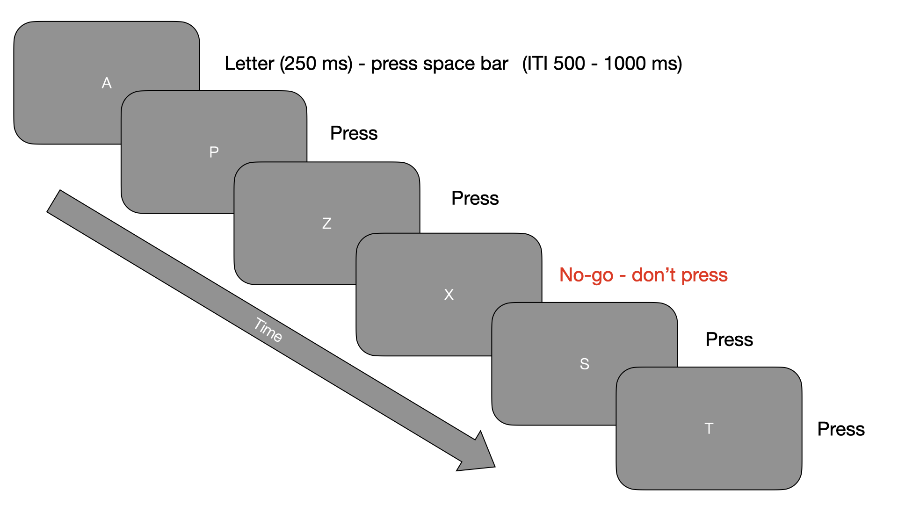

```{r, include=FALSE}
knitr::opts_chunk$set(echo = FALSE,
                      warning = FALSE,
                      tidy = FALSE,
                      message = FALSE,
                      fig.align = 'center',
                      out.width = "100%")
options(knitr.table.format = "html") 
```


```{r upload and wrangle data, include = FALSE}
library(ggrain)
library(tableone)
library(janitor)
library(tidyverse)
library(expss)
library(psych)
library(patchwork)
library(ggpubr)
library(kableExtra)
library(broom)

allData <- read_csv("data/Qualtrics_CPT_RealEye.csv")

allData  <- clean_names(allData ) # use janitor to clean column names

val_lab(allData$gender) = num_lab("
             1 Male
             2 Female
             3 Other    ")  # Add value labels

val_lab(allData$adhd_yn) = num_lab("
             0 No
             1 Yes ")  # Add value labels


allData <- allData %>%
  mutate(adhd_diagnosed = case_when(
    adhd_yn ==  0 ~ "No",
    adhd_yn ==  1 ~ "Yes",
    TRUE ~ NA  # Keep other values unchanged
  ))

myVars <- c("age","gender")
catVars <- c("gender")

allData$log_scanpath_length <- log10(allData$scanpath_length)


tab1 <- print(CreateTableOne(vars = myVars, strata = "adhd_yn", data = allData, factorVars = catVars, test = FALSE))

## ASRS scoring and screening

ASRS <- select(allData, starts_with("q23"))

ASRS_hyperactive <- select(ASRS, contains("hyper_impulsivity"))
ASRS_inattentive <- select(ASRS, contains("inattentiveness"))

ASRS_screener <- select(ASRS, 1:6)
keys_ASRS <-  rep(1, 18)
keys_ASRS_screener <- rep(1,6)
keys_ASRS_subscales <- rep(1,9)

ASRS_screen_scores <- scoreItems(keys_ASRS_screener, ASRS_screener, totals = TRUE)
allData$asrs_part_a<-ASRS_screen_scores$scores[,1]

ASRS_total <- scoreItems(keys_ASRS, ASRS, totals = TRUE)
allData$asrs_total <- ASRS_total$scores[,1]

ASRS_inattentiveness_scores <- scoreItems(keys_ASRS_subscales, ASRS_inattentive, totals = TRUE)
allData$asrs_inattentiveness <- ASRS_inattentiveness_scores$scores[,1]

ASRS_hyperactivity_scores <- scoreItems(keys_ASRS_subscales, ASRS_hyperactive, totals = TRUE)
allData$asrs_hyperactivity_impulsivity <- ASRS_hyperactivity_scores$scores[,1]


# Make a new variable with probable OR diagnosed ADHD
allData <- allData %>%
  mutate(adhd_probable = case_when(
    adhd_diagnosed == 'Yes' ~ "Yes",
    asrs_part_a <  14 ~ "No",
    asrs_part_a >=  14 ~ "Yes",
    TRUE ~ NA  # Keep other values unchanged
  ))


allData <- allData %>%
  mutate(adhd_probable_binary = case_when(
    adhd_probable == 'Yes' ~ 1,
    adhd_probable =='No' ~0 ,
    TRUE ~ NA  # Keep other values unchanged
  ))


## ASRS plots from survey part

asrs_screen_plot <- ggplot(data=subset(allData, !is.na(adhd_diagnosed)), aes(x = adhd_diagnosed, y = asrs_part_a, fill = adhd_diagnosed)) +
  geom_rain(rain.side = 'l', alpha = .7) + scale_fill_brewer(palette = 'Set1', guide = 'none')+ylab('ASRS part A (screener)') + xlab('ADHD diagnosis') + theme_classic()

asrs_inattentiveness_plot <- ggplot(data=subset(allData, !is.na(adhd_diagnosed)), aes(x = adhd_diagnosed, y = asrs_inattentiveness, fill = adhd_diagnosed)) +
  geom_rain(rain.side = 'l', alpha = .7) + scale_fill_brewer(palette = 'Set1', guide = 'none')+ylab('ASRS inattentiveness') + xlab('ADHD diagnosis') + theme_classic()

asrs_hyperactivity_plot <- ggplot(data=subset(allData, !is.na(adhd_diagnosed)), aes(x = adhd_diagnosed, y = asrs_hyperactivity_impulsivity, fill = adhd_diagnosed)) +
  geom_rain(rain.side = 'l', alpha = .7) + scale_fill_brewer(palette = 'Set1', guide = 'none')+ylab('ASRS hyperactivity and impulsivity') + xlab('ADHD diagnosis') + theme_classic()

asrs_screen_plot + asrs_inattentiveness_plot + asrs_hyperactivity_plot

## CPT-noX plots

dPrime_plot <- ggplot(data=subset(allData, !is.na(adhd_diagnosed)), aes(x = adhd_diagnosed, y = d_prime, fill = 	adhd_diagnosed)) +
  geom_rain(rain.side = 'l', alpha = .7) + scale_fill_brewer(palette = 'Set1', guide = 'none')+ylab('CPT No-X d Prime') + xlab('ADHD diagnosis') + theme_classic()

rt_plot <- ggplot(data=subset(allData, !is.na(adhd_diagnosed)), aes(x = adhd_diagnosed, y = r_ts, fill = 	adhd_diagnosed)) +
  geom_rain(rain.side = 'l', alpha = .7) + scale_fill_brewer(palette = 'Set1', guide = 'none')+ylab('CPT No-X mean RT') + xlab('ADHD diagnosis') + theme_classic()

comissions_plot <- ggplot(data=subset(allData, !is.na(adhd_diagnosed)), aes(x = adhd_diagnosed, y = errors_commission, fill = 	adhd_diagnosed)) +
  geom_rain(rain.side = 'l', alpha = .7) + scale_fill_brewer(palette = 'Set1', guide = 'none')+ylab('CPT No-X errors of commission') + xlab('ADHD diagnosis') + theme_classic()

dPrime_plot + rt_plot + comissions_plot


## Scatter plots

errors_commission_scatter <- ggscatter(allData, x = 'asrs_hyperactivity_impulsivity', y = 'errors_commission',
                               color = 'darkred', shape = 21, size = 1,
                               add = 'reg.line', conf.int = TRUE, cor.coef = TRUE,
                               cor.coeff.args = list(method = "spearman", label.x = 3.5, label.sep = "\n")) + xlab ('ASRS hyperactivity/impulsivity') + ylab('CPT-X errors of commission')

dPrime_scatter <- ggscatter(allData, x = 'asrs_hyperactivity_impulsivity', y = 'd_prime',
                                       color = '#008080', shape = 21, size = 1,
                                       add = 'reg.line', conf.int = TRUE, cor.coef = TRUE,
                                       cor.coeff.args = list(method = "spearman", label.x = 3.5, label.y = 0.4, label.sep = "\n")) + xlab ('ASRS hyperactivity/impulsivity') + ylab('CPT-X d Prime score')

inattentiveness_scatter <- ggscatter(allData, x = 'asrs_inattentiveness', y = 'errors_commission',
                                       color = "#0b4545", shape = 21, size = 1,
                                       add = 'reg.line', conf.int = TRUE, cor.coef = TRUE,
                                       cor.coeff.args = list(method = "spearman", label.x = 3.5, label.sep = "\n")) + xlab ('ASRS inattentivness') + ylab('CPT-X errors of commission')


scanpath_scatter <- ggscatter(allData, x = 'asrs_total', y = 'log_scanpath_length',
                              color = 'darkred', shape = 21, size = 1,
                              add = 'reg.line', conf.int = TRUE, cor.coef = TRUE,
                              cor.coeff.args = list(method = "spearman", label.x = 3.5, label.y = 4.0, label.sep = "\n")) + xlab ('ASRS total') + ylab('Log scanpath length')

fixation_count_scatter <- ggscatter(allData, x = 'asrs_total', y = 'fixation_count',
                            color = '#008080', shape = 21, size = 1,
                            add = 'reg.line', conf.int = TRUE, cor.coef = TRUE,
                            cor.coeff.args = list(method = "spearman", label.x = 3.5, label.y = 150, label.sep = "\n")) + xlab ('ASRS total') + ylab('Fixation count')

fixation_duration_scatter <- ggscatter(allData, x = 'asrs_total', y = 'fixation_duration_ms',
                               color = '#0b4545', shape = 21, size = 1,
                               add = 'reg.line', conf.int = TRUE, cor.coef = TRUE,
                               cor.coeff.args = list(method = "spearman", label.x = 3.5, label.y = 220, label.sep = "\n")) + xlab ('ASRS total') + ylab('Fixation duration (ms)')


## Logistic regression 

logRegFit <- glm(adhd_probable_binary ~ age + gender + errors_omission + errors_commission + r_ts + log_scanpath_length + fixation_duration_ms + fixation_count, data = allData, family = binomial)


or_table <- tidy(logRegFit, exponentiate = TRUE, conf.int = TRUE)

```


# Introduction

Diagnosis of Attention Deficit Hyperactivity Disorder (ADHD) is currently quite fragmented and ad hoc [@planton_role_2021]. Diagnostic criteria rely on either self-report, parent-report or both; the main validated survey for adults is the Adult ADHD Self-Report Scale [ASRS\; @kessler_world_2005]. There is increasing interest in more objective measures to increase precision and reliability in diagnosis; since ADHD is construed as a disorder which affects attention, behavioural tasks which are designed to measure various aspects of attention should be applicable The Continuous Performance Test (CPT) is commonly used [@epstein_continuous_1998]. In addition, eye tracking measures are a promising line of enquiry and have shown differences in lab-based studies between individuals with ADHD and controls [@conrad_b_2023]. These have the potential to show early warning signs even in babies too young to perform behavioural tasks. We investigated the potential to use online webcam-based eye tracking and behavioural tasks for remote diagnosis. 

```{r, include=FALSE}
knitr::write_bib(c('posterdown', 'rmarkdown','pagedown'), 'packages.bib')
```

## Objectives

1. Recruit online participants with and without diagnosed ADHD
2. Collect survey data (ASRS + demographics)
3. Online eye-tracking (RealEye)
4. Online behavioural data collection (Continuous Performance Task - Non-X)

# Methods

## Participants 

```{r descriptives, echo=FALSE}
tab1 %>%
  kable(caption = "Descriptive statistics for age and gender by ADHD diagnosis") %>%
  kable_styling()
```


- 118 completed ASRS (Age: 18-60, M = 36; 24 male)
- 58 also completed eye tracking and CPT
- Dropout may have been caused by webcam and browser restrictions 

## Measures 

- Adult ADHD self-report scale (ASRS- ref)
- CPT-noX (Pavlovia/PsychoPy) - errors of omission, errors of commission, d', mean RT
- Eye tracking (RealEye) - fixation duration, fixation count, scanpath length

## Procedure

 - Qualtrics survey (information, consent, demographics, ASRS)
 - RealEye online eye tracking - while doing practice task for CPT-noX (ask me why)
 - CPT-NoX - Pavlovia - see Figure \@ref(fig:CPT-fig)
 
```{r CPT-fig, echo = FALSE, fig.cap = "An illustration of the CPT No-X paradigm"}
 
knitr:::

```

# Results

Participants who had been diagnosed with ADHD were higher on the ASRS (total and subscales), although there was some overlap - see Figure \@ref(fig:asrs-fig).

```{r asrs-fig, echo = FALSE, fig.cap="ASRS part A (screening section) and subscales for diagnosed and non-diagnosed participants", out.width="100%", fig.height=4, warning=FALSE}

asrs_screen_plot + asrs_inattentiveness_plot + asrs_hyperactivity_plot

```

Because so few participants diagnosed with ADHD completed the eye tracking and CPT-X, and since the study attracted the interest of many who suspected they might have ADHD (reflected in the qualitative data and the proportion who scored above the clinical cutoff for Section A), we thought it would be interesting to look at correlations between the ASRS subscales and the behavioural and eye tracking data (also preregistered). There were strong correlations for the behavioural data, but not for any of the eye tracking measures - see Figure \@ref(fig:correlations-fig)

```{r correlations-fig, echo=FALSE, fig.cap='Correlations between ASRS measures and behavioural (top) and eye tracking measures (bottom)', fig.height=6, out.width="100%"}
#trim whitespace
par(mar=c(2,2,0,0))
#plot boxplots
(errors_commission_scatter | dPrime_scatter | inattentiveness_scatter)/(scanpath_scatter|fixation_count_scatter|fixation_duration_scatter)

```

Due to the low number of participants diagnosed with ADHD who completed the CPT (11) and eye tracking (12), we diverged from the preregistration for the final analysis (hierarchical logistic regression) by using the ASRS clinical cutoff to assign non-diagnosed individuals to the ADHD group based on their scores. This resulted in groups of 28 probable/diagnosed ADHD participants and 30 controls. 

A hierarchical logistic regression showed that, after controlling for age and gender, CPT variables errors of commission, errors of omission and reaction times predicted group membership, but no eye tracking variables were significant in the model. See Table \@ref(tab:logistic-regression-tab)

```{r logistic-regression-tab, echo=FALSE}
or_table %>%
  kable(caption = "Odds ratio table for the logistic regression fit") %>%
  kable_styling()
```

# Discussion 

- CPT no-X is feasible to use online as an ADHD diagnostic tool 
- Online eye tracking is not there yet (at least not RealEye)
- Tracking for a longer time across entire task would have been better (but calibration may have been an issue?)
- Integrating more objective measures in ADHD diagnosis is feasible, even in an online environment
- Could be useful for rural/remote diagnosis where clinical services are limited


# References
