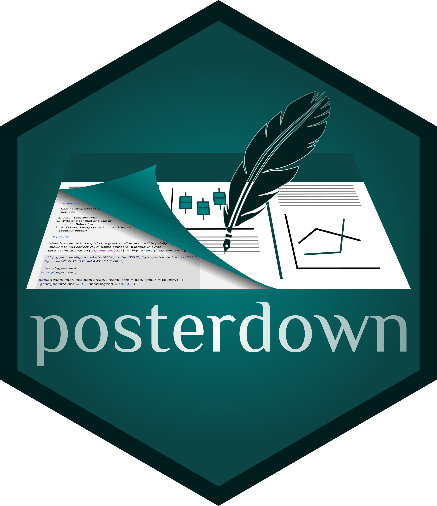

# posterdown

<!-- badges: start -->
[](https://www.tidyverse.org/lifecycle/#maturing)
[](https://travis-ci.com/brentthorne/posterdown)
[](https://CRAN.R-project.org/package=posterdown) 
[](https://cranlogs.r-pkg.org/badges/grand-total/posterdown)
[](https://cranlogs.r-pkg.org/badges/last-day/posterdown)
[](https://CRAN.R-project.org/package=posterdown)
<!-- badges: end -->

This poster was created using the Posterdown package by Brent Thorne. See below for some tips on how to make your own! 

|   Quick Links  |
|:-------|
| [**Current Template Styles**](https://github.com/brentthorne/posterdown#current-template-styles) |
| [**Getting Started**](https://github.com/brentthorne/posterdown#getting-started) |
| [**Support**](https://github.com/brentthorne/posterdown#support) |
| [**Wiki**](https://github.com/brentthorne/posterdown/wiki) |
| [**Showcase**](https://github.com/brentthorne/posterdown/wiki/Showcase) |

## Current Template Styles

| `posterdown_html` | `posterdown_betterland` | `posterdown_betterport` |
|:---------------:|:---------------------:|:---------------------:|
|[](https://brentthorne.github.io/posterdown_html_showcase/) |  |  |

## Getting Started


> posterdown v1.0 is now on [CRAN](https://cran.r-project.org/web/packages/posterdown/index.html) !! :smile:

To install from CRAN use `install.packages("posterdown")`.

To install from github use `remotes::install_github("brentthorne/posterdown")`. 

Now add this to the YAML options of your rmarkdown (.Rmd) file:

```markdown
---
output: 
  posterdown::posterdown_html
---
```

For further customization options please see the (currently in progress :hammer:) [wiki](https://github.com/brentthorne/posterdown/wiki)


